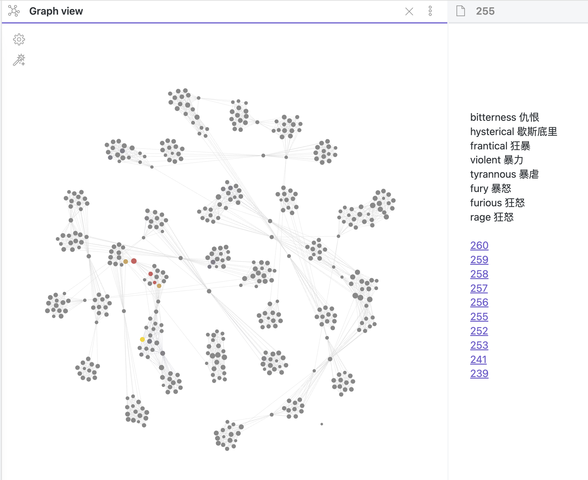

# GRE_Dict

> This *Graphical Dictionary* can help you remember words in similar semantics.

## How to use?

1. Git clone the latest version.
2. Download Obsidean.app;
3. Open this folder.

## Preview

## Version

- **version 1.0** (2022/9/4): 4,540 GRE words 